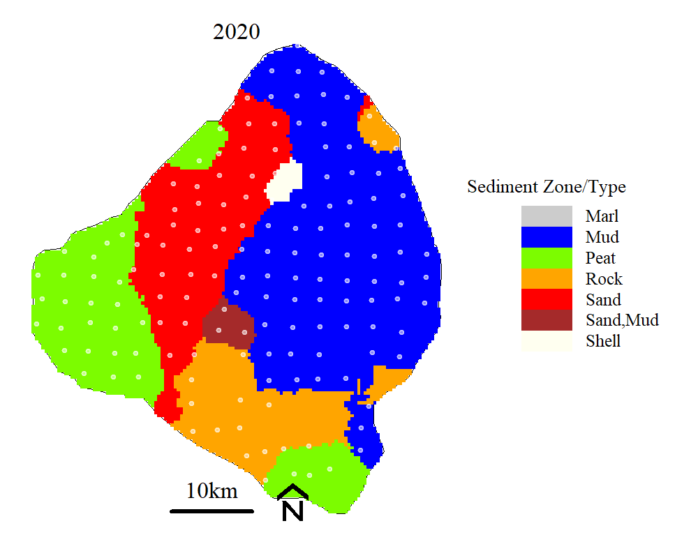
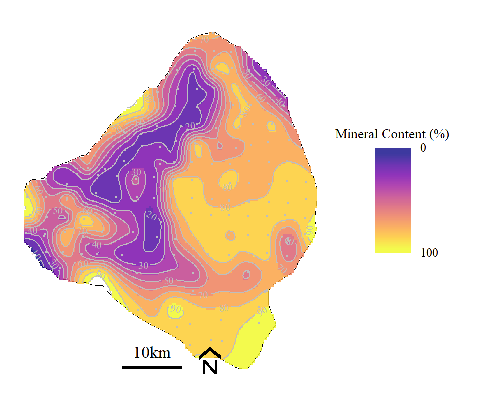
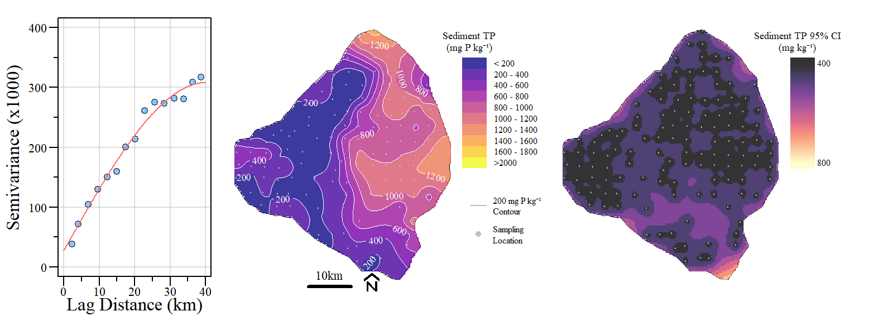
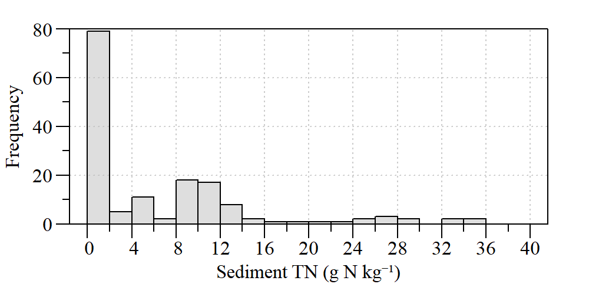
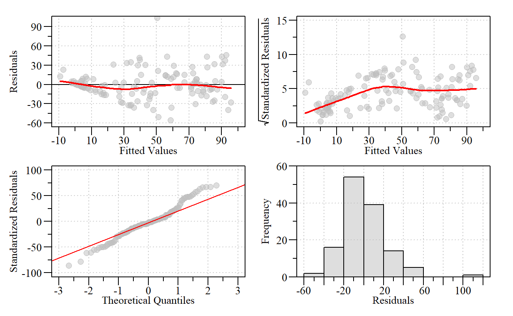
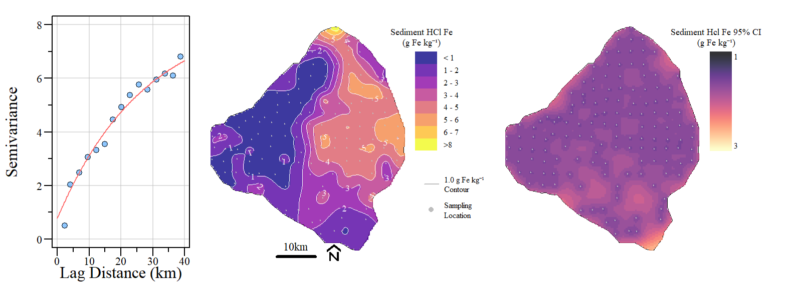
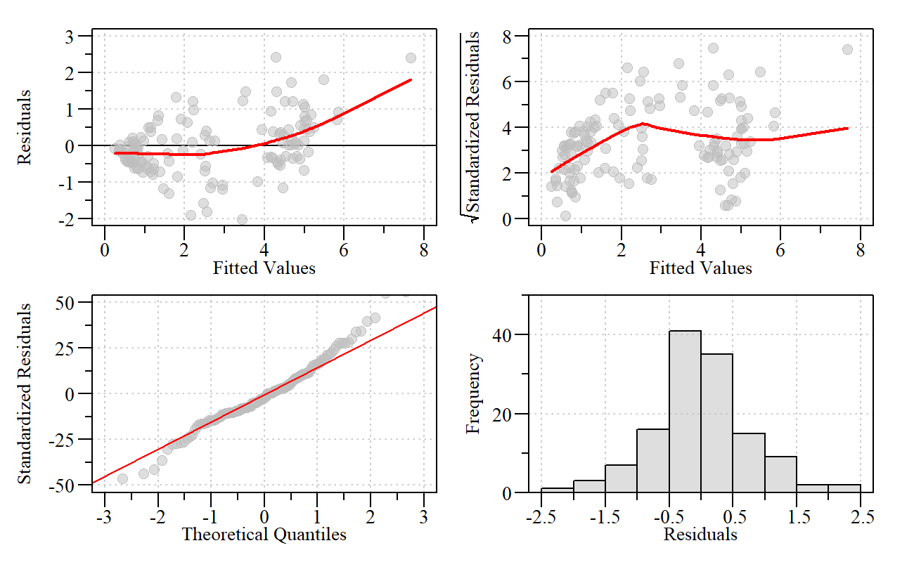
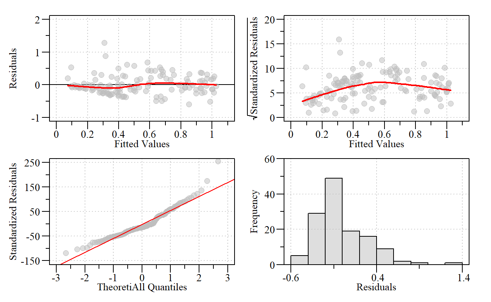
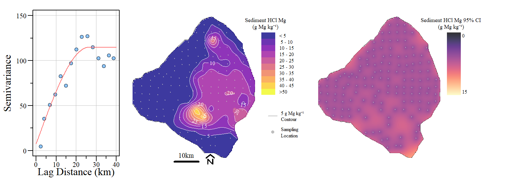
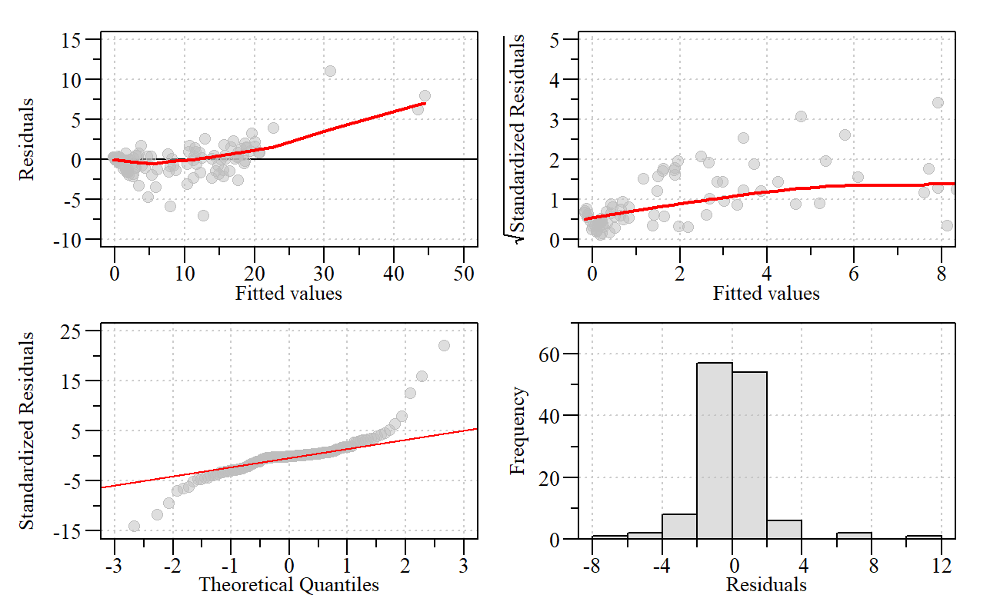

```{r setup, include=FALSE}
knitr::opts_chunk$set(warning = FALSE, message = FALSE, echo=FALSE)

library(flextable)
library(magrittr)
library(bsplus)
library(htmltools)
```

`r paste("Updated",as.POSIXct(Sys.time(),"%Y-%m-%d %H:%M",tz=""))`

Provisional and preliminary results for the Lake Okeechobee 2020/2021 sediment sampling conducted by University of Florida.

***
# Sediment Zones

```{r ,fig.align="center",out.width="75%",fig.cap="Sediment zones across Lake Okeechobee observed during the 2020/2021 sampling."}


```

```{r} 
bsplus::bs_button(
    label = "Download GeoTiff",
    button_type = "primary",
    button_size = "small") %>%
    htmltools::a(
      href = "https://github.com/SwampThingPaul/LakeO_Sediment/raw/main/export/LOK_2020_SedZone.tif"
      )
```

```{r} 
bsplus::bs_button(
    label = "Download Shapefile",
    button_type = "primary",
    button_size = "small") %>%
    htmltools::a(
      href = "https://github.com/SwampThingPaul/LakeO_Sediment/raw/main/export/shapefiles/LOK_2020_SedZone.zip"
      )
```

<br>
* Spatially interpolated using weighted k-nearest neighbor classifier with up to 10 nearest neighbots considered (i.e. k=10; `kknn` function in the `kknn` R-library).  

***
# Mud Depth

```{r ,fig.align="center",out.width="75%",fig.cap="Mud depth across Lake Okeechobee observed during the 2020/2021 sampling."}

knitr::include_graphics('./plots/Sed2020/LOK_muddepth_spline.png')
```

```{r} 
bsplus::bs_button(
    label = "Download GeoTiff",
    button_type = "primary",
    button_size = "small") %>%
    htmltools::a(
      href = "https://github.com/SwampThingPaul/LakeO_Sediment/raw/main/export/LOK_2020_MudDepth.tif"
      )
```

<br>
* Spatially interpolated using tension spline (`Tps` function in the `fields` R-library).  

***
# Bulk Density

```{r ,fig.align="center",out.width="75%",fig.cap="Bulk Density across Lake Okeechobee observed during the 2020/2021 sampling."}


```

```{r} 
bsplus::bs_button(
    label = "Download GeoTiff",
    button_type = "primary",
    button_size = "small") %>%
    htmltools::a(
      href = "https://github.com/SwampThingPaul/LakeO_Sediment/raw/main/export/LOK_2020_BD.tif"
      )
```

<br>
* Spatially interpolated using tension spline (`Tps` function in the `fields` R-library).  


***
# Mineral Content


```{r ,fig.align="center",out.width="75%",fig.cap="Mineral content across Lake Okeechobee observed during the 2020/2021 sampling."}


```

```{r} 
bsplus::bs_button(
    label = "Download GeoTiff",
    button_type = "primary",
    button_size = "small") %>%
    htmltools::a(
      href = "https://github.com/SwampThingPaul/LakeO_Sediment/raw/main/export/LOK_2020_MC.tif"
      )
```

<br>
* Spatially interpolated using tension spline (`Tps` function in the `fields` R-library).  


***
# Total Phoshorus 
```{r ,fig.align="center",out.width="100%",fig.cap="Total phosphorus across Lake Okeechobee observed during the 2020/2021 sampling including (left) semivariogram, (center) interpolated TP concentrations and (right) 95% Confience Interval interpolation."}


```

```{r} 
bsplus::bs_button(
    label = "Download Conc. Krige GeoTiff",
    button_type = "primary",
    button_size = "small") %>%
    htmltools::a(
      href = "https://github.com/SwampThingPaul/LakeO_Sediment/raw/main/export/LOK_2020_SedTP.tif"
      )
```

```{r}
TP.rslts=read.csv('./Export/krige_rslts/TP_rslts.csv')
TP.rslts%>%
        flextable()%>%
        colformat_double(j=2:4,big.mark = "",digits = 0)%>%
        colformat_double(j=5,digits=1)%>%
        colformat_double(j=6:8,digits=2)%>%
  set_caption(caption="Sediment total phosphorus kriging model fit results")
```


**Model diagnostic plots**
```{r ,fig.align="center",out.width="75%",fig.cap="Total phosphorus krige model diagonistic plots including residual versus fitted (top left), QQplot (bottom left), scale-location (top right) and histogram of residuals (bottom right). Residuals are not significantly different from a normal distribution (Shapiro-Wilk; W=0.99, p value=0.42)."}

knitr::include_graphics('./plots/Sed2020/TPModel_diag.png')
```


***
# Inorganic Phoshorus (HCl TP)

* Data was log-transformed prior to variogram fitting.
* After kriging, the data were back-transformed consistent with Yamamoto (2007) and Journel (1980)

```{r ,fig.align="center",out.width="50%",fig.cap="Comparison of original values, back-transformed and corrected back-transformed data."}

knitr::include_graphics('./plots/Sed2020/LOK_HClTPKrig_BT.den.png')
```

```{r ,fig.align="center",out.width="100%",fig.cap="Inorganic phosphorus (HCl extracted) across Lake Okeechobee observed during the 2020/2021 sampling including (left) semivariogram, (center) interpolated TP concentrations and (right) 95% Confience Interval interpolation."}

knitr::include_graphics('./plots/Sed2020/LOK_HClTPKrig_CI.png')
```

```{r} 
bsplus::bs_button(
    label = "Download Conc. Krige GeoTiff",
    button_type = "primary",
    button_size = "small") %>%
    htmltools::a(
      href = "https://github.com/SwampThingPaul/LakeO_Sediment/raw/main/export/LOK_2020_SedHClTP.tif"
      )
```

```{r}
rslts=read.csv('./Export/krige_rslts/HClTP_rslts.csv')
rslts%>%
        flextable()%>%
        colformat_double(j=2:3,big.mark = "",digits = 3)%>%
        colformat_double(j=4,big.mark = "",digits = 0)%>%
        colformat_double(j=5,digits=1)%>%
        colformat_double(j=6,digits=3)%>%
        colformat_double(j=7:8,digits=2)%>%
  set_caption(caption="Sediment inorganic phosphorus kriging model fit results. Data were log-transformed to fit assumptions of the model and improve model fit.")
```

**Model diagnostic plots**
```{r ,fig.align="center",out.width="75%",fig.cap="Inorganic phosphorus (HCl extracted) krige model diagonistic plots including residual versus fitted (top left), QQplot (bottom left), scale-location (top right) and histogram of residuals (bottom right). Residuals are not significantly different from a normal distribution (Shapiro-Wilk; W=0.98, p value=0.09)."}

knitr::include_graphics('./plots/Sed2020/HClTPModel_diag.png')
```


***
# Inorganic Phoshorus (NaHCO~3~ P~i~)

* Data was log-transformed prior to variogram fitting.
* After kriging, the data were back-transformed consistent with Yamamoto (2007) and Journel (1980)

```{r ,fig.align="center",out.width="100%",fig.cap="Inorganic phosphorus (NaHCO\u2083 extracted) across Lake Okeechobee observed during the 2020/2021 sampling including (left) semivariogram, (center) interpolated P~i~ concentrations and (right) 95% Confience Interval interpolation."}

knitr::include_graphics('./plots/Sed2020/LOK_NaHCO3PiKrig_CI.png')
```

```{r} 
bsplus::bs_button(
    label = "Download Conc. Krige GeoTiff",
    button_type = "primary",
    button_size = "small") %>%
    htmltools::a(
      href = "https://github.com/SwampThingPaul/LakeO_Sediment/raw/main/export/LOK_2020_SedNaHCO3_Pi.tif"
      )
```

```{r}
rslts=read.csv('./Export/krige_rslts/NaHCO3Pi_rslts.csv')
rslts%>%
        flextable()%>%
        colformat_double(j=2:3,big.mark = "",digits = 3)%>%
        colformat_double(j=4,big.mark = "",digits = 0)%>%
        colformat_double(j=5,digits=1)%>%
        colformat_double(j=6,digits=3)%>%
        colformat_double(j=7:8,digits=2)%>%
  set_caption(caption="Sediment inorganic phosphorus (NaHCO\u2083 extracted) kriging model fit results. Data were log-transformed to fit assumptions of the model and improve model fit.")
```


**Model diagnostic plots**
```{r ,fig.align="center",out.width="75%",fig.cap="Inorganic phosphorus (NaHCO\u2083 extracted) krige model diagonistic plots including residual versus fitted (top left), QQplot (bottom left), scale-location (top right) and histogram of residuals (bottom right). Residuals are not significantly different from a normal distribution (Shapiro-Wilk; W=0.98, p value=0.07)."}


```

***
# Inorganic Phoshorus (KCl P~i~)

**place holder**
**Values below MDL - waiting on Lab for MDL value(s)**

***
# Total Nitrogen

* 69 of the 148 samples were reported less than the MDL (0.200 g kg^-1^)

```{r ,fig.align="center",out.width="75%",fig.cap="Histogram of sediment total nitrogen concentrations sampled across Lake Okeechobee observed during the 2020/2021 sampling."}


```

```{r ,fig.align="center",out.width="75%",fig.cap="Bubbleplot of total nitrogen across Lake Okeechobee observed during the 2020/2021 sampling."}


```


***
# Ammonia (KCl extracted NH3)

**place holder**


***
# Calcium (HCl extracted Ca)

```{r ,fig.align="center",out.width="100%",fig.cap="Calcium (HCl extracted) across Lake Okeechobee observed during the 2020/2021 sampling including (left) semivariogram, (center) interpolated Ca concentrations and (right) 95% Confience Interval interpolation."}


```

```{r} 
bsplus::bs_button(
    label = "Download Conc. Krige GeoTiff",
    button_type = "primary",
    button_size = "small") %>%
    htmltools::a(
      href = "https://github.com/SwampThingPaul/LakeO_Sediment/raw/main/export/LOK_2020_SedHClCa.tif"
      )
```

```{r}
rslts=read.csv('./Export/krige_rslts/HClCa_rslts.csv')
rslts%>%
        flextable()%>%
        colformat_double(j=2:3,big.mark = "",digits = 3)%>%
        colformat_double(j=4,big.mark = "",digits = 0)%>%
        colformat_double(j=5,digits=1)%>%
        colformat_double(j=6,digits=3)%>%
        colformat_double(j=7:8,digits=2)%>%
  set_caption(caption="Calcium (HCl extracted) kriging model fit results. Data were log-transformed to fit assumptions of the model and improve model fit.")
```

**Model diagnostic plots**
```{r ,fig.align="center",out.width="75%",fig.cap="Calcium (HCl extracted) krige model diagonistic plots including residual versus fitted (top left), QQplot (bottom left), scale-location (top right) and histogram of residuals (bottom right). Residuals are not significantly different from a normal distribution."}


```

* Ordinary krige model residuals were not normally distributed (**NOTE:** Ordinary krige interpolation does not depend on any distribution assumptions). 

***
# Iron (HCl extracted Fe)

```{r ,fig.align="center",out.width="100%",fig.cap="Iron (HCl extracted) across Lake Okeechobee observed during the 2020/2021 sampling including (left) semivariogram, (center) interpolated Fe concentrations and (right) 95% Confience Interval interpolation."}


```

```{r} 
bsplus::bs_button(
    label = "Download Conc. Krige GeoTiff",
    button_type = "primary",
    button_size = "small") %>%
    htmltools::a(
      href = "https://github.com/SwampThingPaul/LakeO_Sediment/raw/main/export/LOK_2020_SedHClFe.tif"
      )
```

```{r}
rslts=read.csv('./Export/krige_rslts/HClFe_rslts.csv')
rslts%>%
        flextable()%>%
        colformat_double(j=2:3,big.mark = "",digits = 3)%>%
        colformat_double(j=4,big.mark = "",digits = 0)%>%
        colformat_double(j=5,digits=1)%>%
        colformat_double(j=6,digits=3)%>%
        colformat_double(j=7:8,digits=2)%>%
  set_caption(caption="Iron (HCl extracted) kriging model fit results. Data were log-transformed to fit assumptions of the model and improve model fit.")
```

**Model diagnostic plots**
```{r ,fig.align="center",out.width="75%",fig.cap="Iron (HCl extracted) krige model diagonistic plots including residual versus fitted (top left), QQplot (bottom left), scale-location (top right) and histogram of residuals (bottom right). Residuals are not significantly different from a normal distribution."}


```

* Ordinary krige model residuals were not normally distributed (**NOTE:** Ordinary krige interpolation does not depend on any distribution assumptions). 


***
# Aluminum (HCl extracted Al)


```{r ,fig.align="center",out.width="100%",fig.cap="Aluminum (HCl extracted) across Lake Okeechobee observed during the 2020/2021 sampling including (left) semivariogram, (center) interpolated Al concentrations and (right) 95% Confience Interval interpolation."}


```

```{r} 
bsplus::bs_button(
    label = "Download Conc. Krige GeoTiff",
    button_type = "primary",
    button_size = "small") %>%
    htmltools::a(
      href = "https://github.com/SwampThingPaul/LakeO_Sediment/raw/main/export/LOK_2020_SedHClAl.tif"
      )
```

```{r}
rslts=read.csv('./Export/krige_rslts/HClAl_rslts.csv')
rslts%>%
        flextable()%>%
        colformat_double(j=2:3,big.mark = "",digits = 3)%>%
        colformat_double(j=4,big.mark = "",digits = 0)%>%
        colformat_double(j=5,digits=1)%>%
        colformat_double(j=6,digits=3)%>%
        colformat_double(j=7:8,digits=2)%>%
  set_caption(caption="Aluminum (HCl extracted) kriging model fit results. Data were log-transformed to fit assumptions of the model and improve model fit.")
```

**Model diagnostic plots**
```{r ,fig.align="center",out.width="75%",fig.cap="Aluminum (HCl extracted) krige model diagonistic plots including residual versus fitted (top left), QQplot (bottom left), scale-location (top right) and histogram of residuals (bottom right). Residuals are not significantly different from a normal distribution."}


```

* Ordinary krige model residuals were not normally distributed (**NOTE:** Ordinary krige interpolation does not depend on any distribution assumptions). 


***
# Magnesium (HCl extracted Mg)


```{r ,fig.align="center",out.width="100%",fig.cap="Magnesium (HCl extracted) across Lake Okeechobee observed during the 2020/2021 sampling including (left) semivariogram, (center) interpolated Mg concentrations and (right) 95% Confience Interval interpolation."}


```

```{r} 
bsplus::bs_button(
    label = "Download Conc. Krige GeoTiff",
    button_type = "primary",
    button_size = "small") %>%
    htmltools::a(
      href = "https://github.com/SwampThingPaul/LakeO_Sediment/raw/main/export/LOK_2020_SedHClMg.tif"
      )
```

```{r}
rslts=read.csv('./Export/krige_rslts/HClMg_rslts.csv')
rslts%>%
        flextable()%>%
        colformat_double(j=2:3,big.mark = "",digits = 3)%>%
        colformat_double(j=4,big.mark = "",digits = 0)%>%
        colformat_double(j=5,digits=1)%>%
        colformat_double(j=6,digits=3)%>%
        colformat_double(j=7:8,digits=2)%>%
  set_caption(caption="Magnesium (HCl extracted) kriging model fit results. Data were log-transformed to fit assumptions of the model and improve model fit.")
```

**Model diagnostic plots**
```{r ,fig.align="center",out.width="75%",fig.cap="Magnesium (HCl extracted) krige model diagonistic plots including residual versus fitted (top left), QQplot (bottom left), scale-location (top right) and histogram of residuals (bottom right). Residuals are not significantly different from a normal distribution."}


```

* Ordinary krige model residuals were not normally distributed (**NOTE:** Ordinary krige interpolation does not depend on any distribution assumptions). 


***
# TN:TP Molar ratio

**place holder**

***
# Ca:Al Molar ratio

<!-- https://www.nrs.fs.fed.us/futures/current_conditions/soil_water_conservation/calcium_aluminum_ratio.html -->

**place holder**


***

# References 

* Journel AG (1980) The lognormal approach to predicting local distributions of selective mining unit grades. Journal of the International Association for Mathematical Geology 12:285–303. doi: 10.1007/BF01029417

* Yamamoto JK (2007) On unbiased backtransform of lognormal kriging estimates. Computational Geosciences 11:219–234. doi: 10.1007/s10596-007-9046-x

