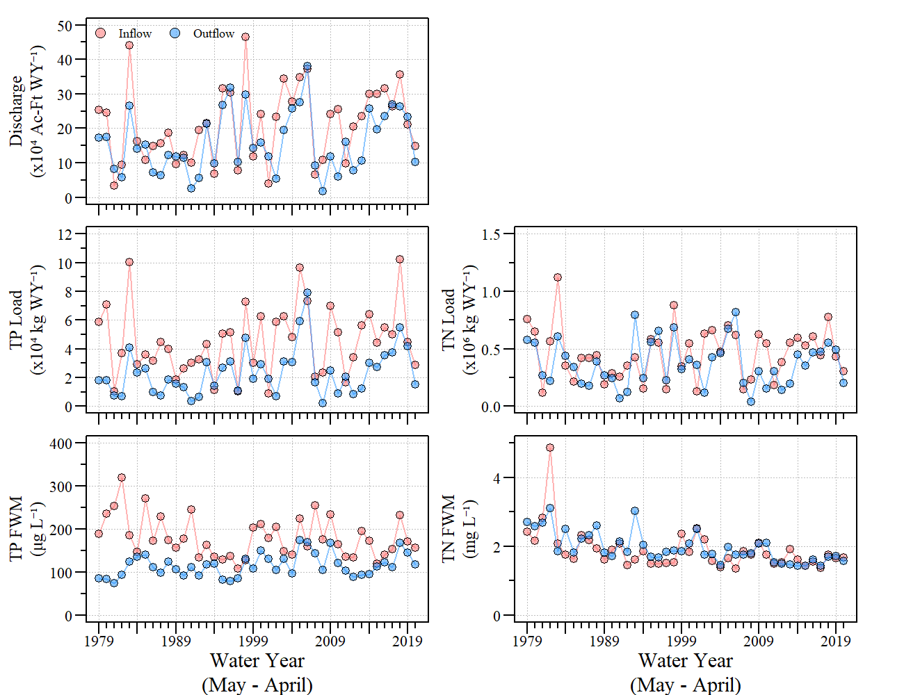

A Study to evaluate Lake Okeechobee Sediment and Water Quality Trends

```{r setup, include=FALSE}
knitr::opts_chunk$set(echo = TRUE)
```

## Contact
Paul Julian | [`r fontawesome::fa(name="fab fa-chrome")`](http://swampthingecology.org) | [`r fontawesome::fa(name="fab fa-twitter")`](https://twitter.com/SwampThingPaul) | [`r fontawesome::fa(name="fas fa-envelope-open-text")`](mailto:pauljulianphd@gmail.com) |


## Description/contents
 - `_docs/`: Additional resources for data analysis purposes.
 - `Data/`: Additional (small) data files used in the analysis. 
 - `exports/`: Exports (tables) from analysis.
 - `plots/`: Figures from the analysis.
 - `src/`: `R`-scripts used to analyze data
 - Other files : associated GitHub and R-project files.
 


### Sub-projects
- Inflow and outflow loads (`src/LakeO_Load_ts_v3.R`)
 
  - Downloads data from DBHydro, calculates monthly inflow and outflow discharge, TP and TN loads or Lake Okeechobee. Also includes the generation of plots such as the one below.
    
```{r figs, out.width="75%",echo=FALSE,fig.align="center",fig.cap='Annual discharge, total phosphorus and total nitrogen loads and flow-weighted mean concentrations for Lake Okeechobee between May 1978 to Apirl 2020'}

```


***