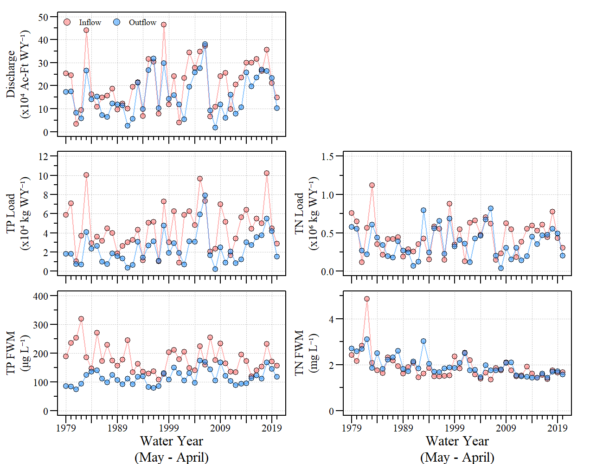

Lake Okeechobee Sediment and Water Quality
================

A Study to evaluate Lake Okeechobee Sediment and Water Quality Trends

## Contact

Paul Julian \|
[<svg xmlns="http://www.w3.org/2000/svg" viewBox="0 0 496 512" class="rfa" style="height:0.75em;fill:currentColor;position:relative;"><path d="M131.5 217.5L55.1 100.1c47.6-59.2 119-91.8 192-92.1 42.3-.3 85.5 10.5 124.8 33.2 43.4 25.2 76.4 61.4 97.4 103L264 133.4c-58.1-3.4-113.4 29.3-132.5 84.1zm32.9 38.5c0 46.2 37.4 83.6 83.6 83.6s83.6-37.4 83.6-83.6-37.4-83.6-83.6-83.6-83.6 37.3-83.6 83.6zm314.9-89.2L339.6 174c37.9 44.3 38.5 108.2 6.6 157.2L234.1 503.6c46.5 2.5 94.4-7.7 137.8-32.9 107.4-62 150.9-192 107.4-303.9zM133.7 303.6L40.4 120.1C14.9 159.1 0 205.9 0 256c0 124 90.8 226.7 209.5 244.9l63.7-124.8c-57.6 10.8-113.2-20.8-139.5-72.5z"/></svg>](http://swampthingecology.org)
\|
[<svg xmlns="http://www.w3.org/2000/svg" viewBox="0 0 512 512" class="rfa" style="height:0.75em;fill:currentColor;position:relative;"><path d="M459.37 151.716c.325 4.548.325 9.097.325 13.645 0 138.72-105.583 298.558-298.558 298.558-59.452 0-114.68-17.219-161.137-47.106 8.447.974 16.568 1.299 25.34 1.299 49.055 0 94.213-16.568 130.274-44.832-46.132-.975-84.792-31.188-98.112-72.772 6.498.974 12.995 1.624 19.818 1.624 9.421 0 18.843-1.3 27.614-3.573-48.081-9.747-84.143-51.98-84.143-102.985v-1.299c13.969 7.797 30.214 12.67 47.431 13.319-28.264-18.843-46.781-51.005-46.781-87.391 0-19.492 5.197-37.36 14.294-52.954 51.655 63.675 129.3 105.258 216.365 109.807-1.624-7.797-2.599-15.918-2.599-24.04 0-57.828 46.782-104.934 104.934-104.934 30.213 0 57.502 12.67 76.67 33.137 23.715-4.548 46.456-13.32 66.599-25.34-7.798 24.366-24.366 44.833-46.132 57.827 21.117-2.273 41.584-8.122 60.426-16.243-14.292 20.791-32.161 39.308-52.628 54.253z"/></svg>](https://twitter.com/SwampThingPaul)
\|
[<svg xmlns="http://www.w3.org/2000/svg" viewBox="0 0 512 512" class="rfa" style="height:0.75em;fill:currentColor;position:relative;"><path d="M176 216h160c8.84 0 16-7.16 16-16v-16c0-8.84-7.16-16-16-16H176c-8.84 0-16 7.16-16 16v16c0 8.84 7.16 16 16 16zm-16 80c0 8.84 7.16 16 16 16h160c8.84 0 16-7.16 16-16v-16c0-8.84-7.16-16-16-16H176c-8.84 0-16 7.16-16 16v16zm96 121.13c-16.42 0-32.84-5.06-46.86-15.19L0 250.86V464c0 26.51 21.49 48 48 48h416c26.51 0 48-21.49 48-48V250.86L302.86 401.94c-14.02 10.12-30.44 15.19-46.86 15.19zm237.61-254.18c-8.85-6.94-17.24-13.47-29.61-22.81V96c0-26.51-21.49-48-48-48h-77.55c-3.04-2.2-5.87-4.26-9.04-6.56C312.6 29.17 279.2-.35 256 0c-23.2-.35-56.59 29.17-73.41 41.44-3.17 2.3-6 4.36-9.04 6.56H96c-26.51 0-48 21.49-48 48v44.14c-12.37 9.33-20.76 15.87-29.61 22.81A47.995 47.995 0 0 0 0 200.72v10.65l96 69.35V96h320v184.72l96-69.35v-10.65c0-14.74-6.78-28.67-18.39-37.77z"/></svg>](mailto:pauljulianphd@gmail.com)
\|

## Description/contents

-   `_docs/`: Additional resources for data analysis purposes.
-   `Data/`: Additional (small) data files used in the analysis.
-   `exports/`: Exports (tables) from analysis.
-   `plots/`: Figures from the analysis.
-   `src/`: `R`-scripts used to analyze data
-   Other files : associated GitHub and R-project files.

### Sub-projects

-   Inflow and outflow loads (`src/LakeO_Load_ts_v3.R`)

    -   Downloads data from DBHydro, calculates monthly inflow and
        outflow discharge, TP and TN loads or Lake Okeechobee. Also
        includes the generation of plots such as the one below.

Annual discharge, total phosphorus and total nitrogen loads and
flow-weighted mean concentrations for Lake Okeechobee between May 1978
to Apirl 2020

------------------------------------------------------------------------
