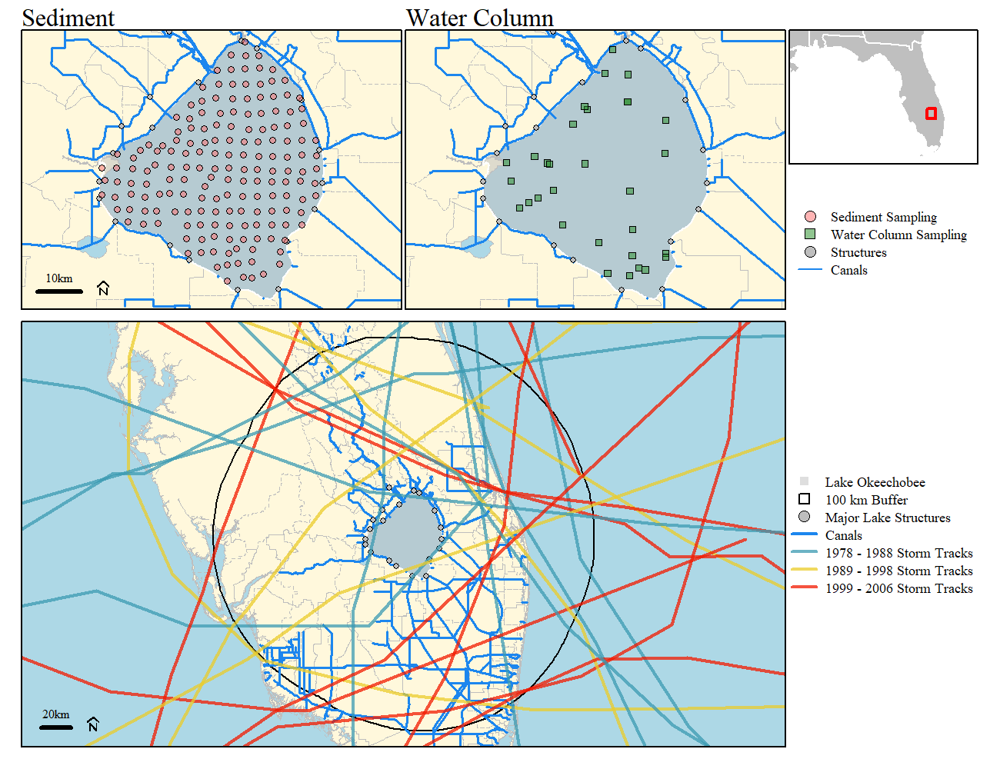
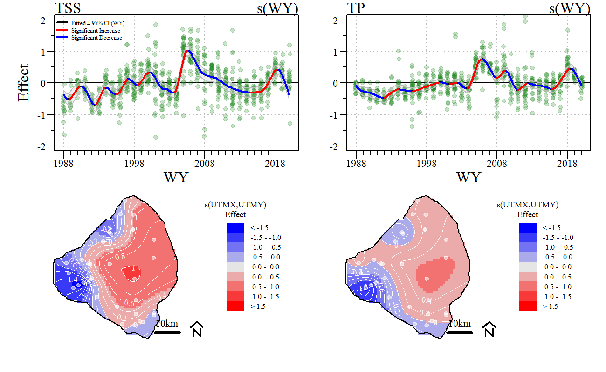
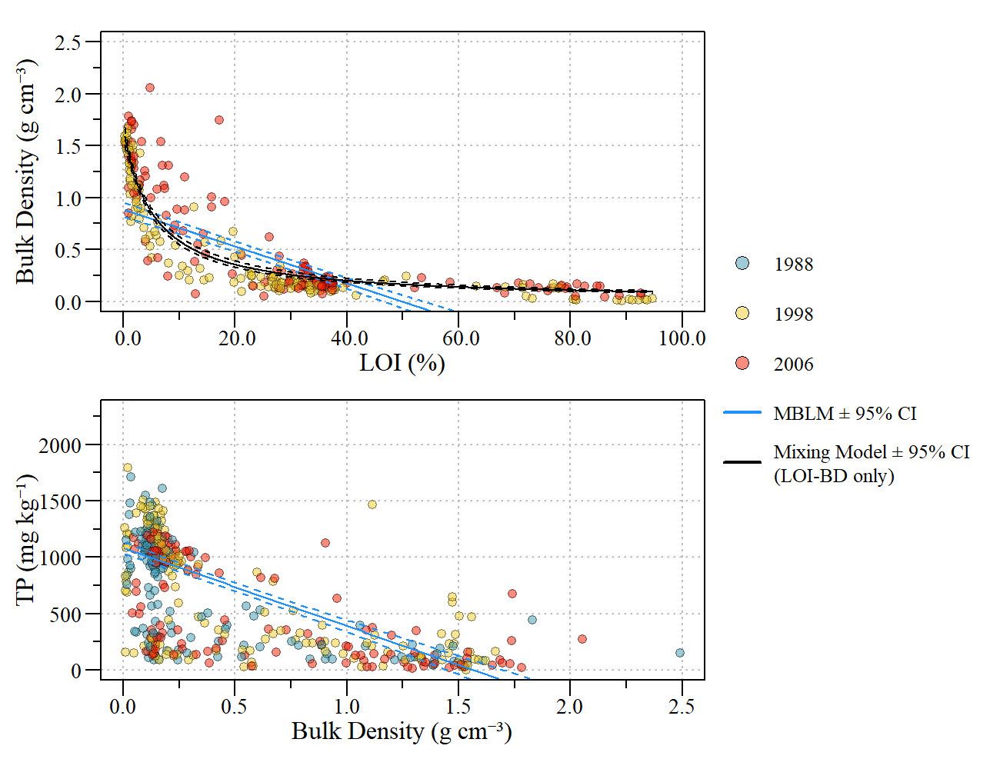
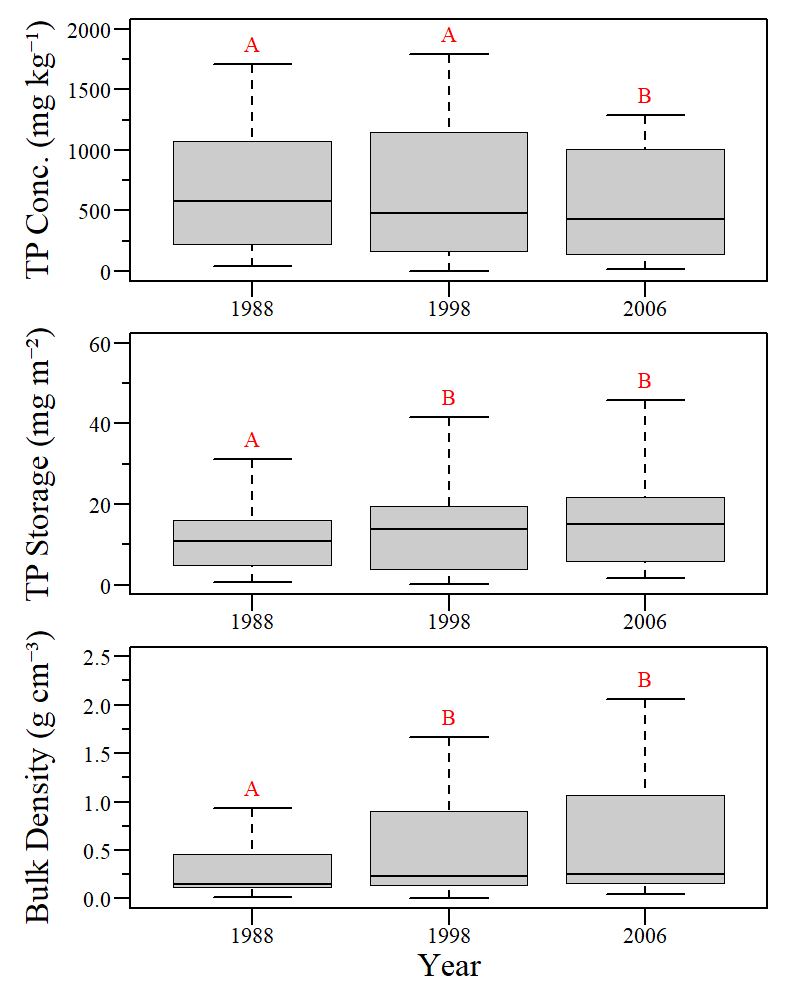
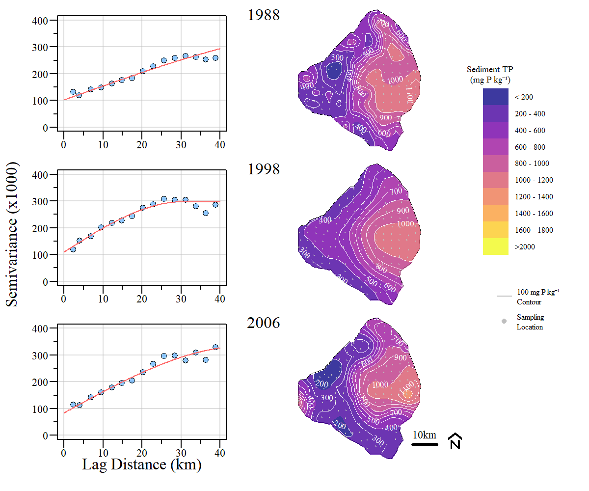
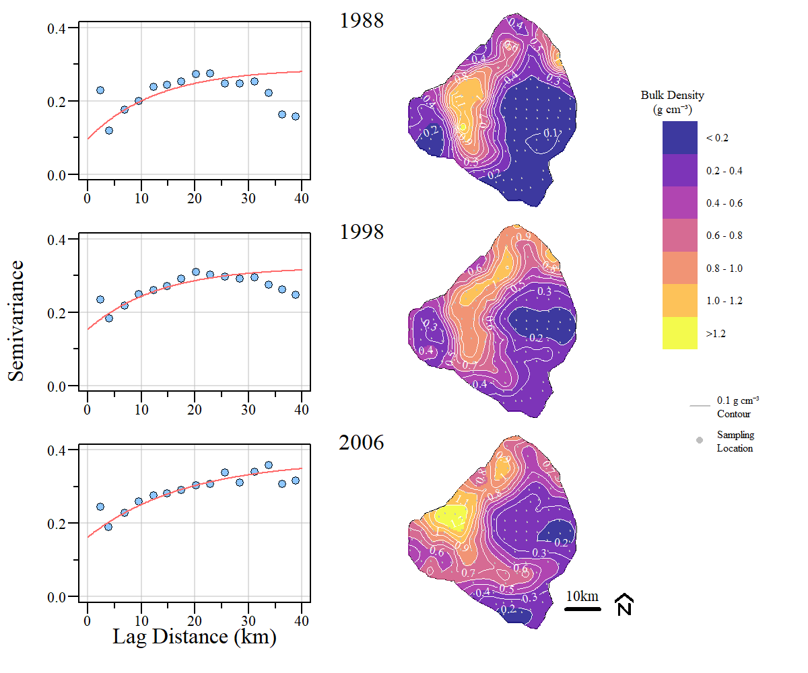
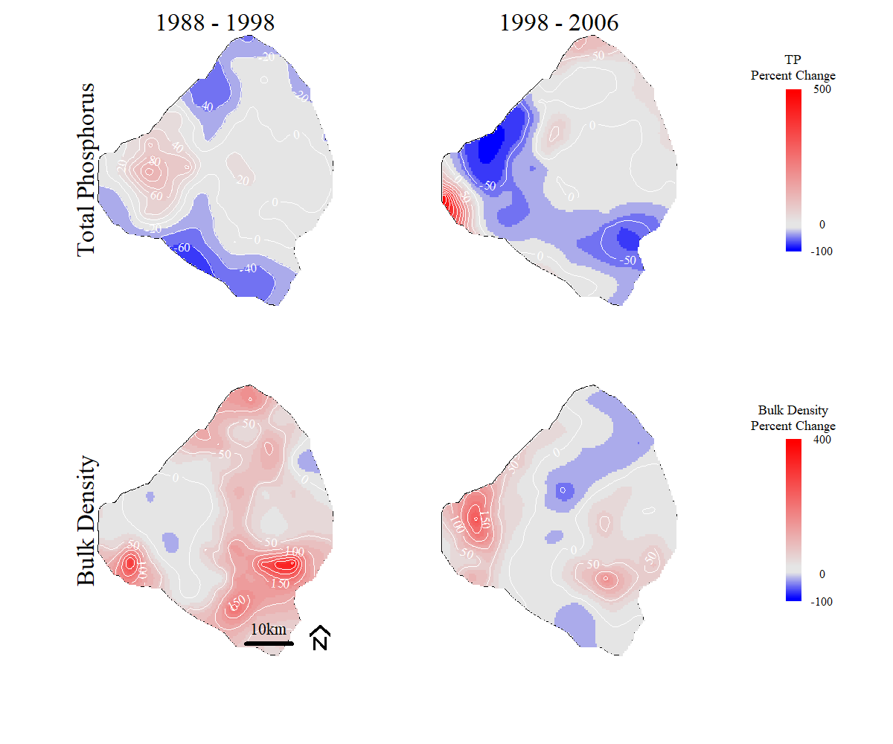
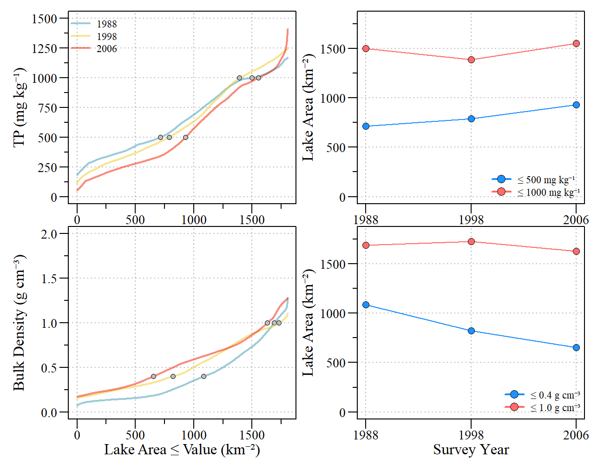
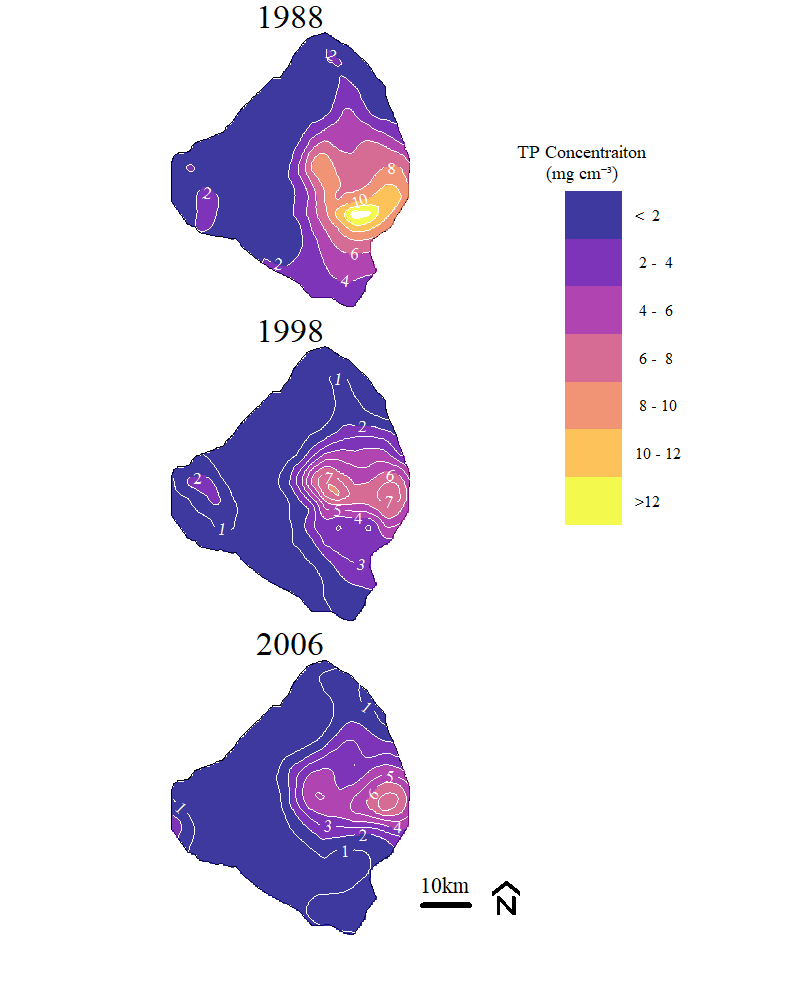

```{r xaringanExtra, include=FALSE, warnint=FALSE}
# devtools::install_github("gadenbuie/xaringanExtra")
# xaringanExtra::use_webcam()
xaringanExtra::use_tile_view()
# xaringanExtra::use_scribble()
# xaringanExtra::use_progress_bar("red", "bottom","0.25em")
```

```{r setup, include=FALSE}
library(knitr)

options(htmltools.dir.version = FALSE)
knitr::opts_chunk$set(warning = FALSE, message = FALSE, echo=FALSE)

##
library(flextable)
library(magrittr)
library(plyr)
library(reshape2)

wd="C:/Julian_LaCie/_GitHub/LakeO_Sediment"

plot.path="C:/Julian_LaCie/_GitHub/LakeO_Sediment/Plots/"
export.path="C:/Julian_LaCie/_GitHub/LakeO_Sediment/Export/"

plot.figs=list.files(paste0(plot.path,"Lamsal_reanalysis/"),full.names=T)
slides.figs="C:/Julian_LaCie/_GitHub/LakeO_Sediment/slides/plots"
file.copy(plot.figs,slides.figs,overwrite=T,recursive=T)

### 
# Functions
notidy_as_flextable_gam<-function(x,data_t=NULL,data_g=NULL,dig.num=2,r2dig=2,...){
  # needs flextable
  # magrittr
  if(sum(class(x)%in%c("gam"))==1&is.null(data_t)&is.null(data_g)){
    data_t <- notidy_tidy_gam(x)
    data_g <- notidy_glance_gam(x)
  }
  
  std_border=officer::fp_border(color = "black", style = "solid", width = 2)
  data.frame(data_t)%>%
    flextable()%>%
    delete_part(part="header")%>%
    hline(i=which(data_t=="Component"),border=std_border)%>%
    hline(i=which(data_t=="Component")[2]-1,border=std_border)%>%
    bold(i=which(data_t=="Component"))%>%
    align(j=1,part="all")%>%
    hline_top(border=std_border)%>%
    hline_bottom(border=std_border)%>%
    merge_v(j=1)%>%valign(j=1,valign="top")%>%fix_border_issues()%>%
    autofit(part = c("header", "body"))%>%
    add_footer_lines(values = c(
      sprintf("Adjusted R-squared: %s, Deviance explained %s", formatC(data_g$adj.r.squared,digits = r2dig,format="f"), formatC(data_g$deviance,digits = r2dig,format="f")),
      paste0(data_g$method,": ",format(round(data_g$sp.crit,dig.num),dig.num),", Scale est.: ",format(round(data_g$scale.est,dig.num),dig.num),", N: ",data_g$nobs)
    ))
}

```

layout: true

---
name: title
class: left, middle

### Here's the story of the Hurricane… Sediment resuspension and phosphorus dynamics in a shallow subtropical lake.

`r paste(format(as.Date("2022-01-25"),"%B %d, %Y"))#,"<br>(Updated:", format(as.Date(Sys.Date()),"%B %d, %Y"),")")`


<!-- this ends up being the title slide since seal = FALSE-->


.footnote[

.small[Use cursor keys for navigation, press .red["O"] for a slide .red[O]verview]

]

---
name: objectives

### Objectives

1. Evaluate the temporal and spatial dynamics of water column total suspended solids and total phosphorus in Lake Okeechobee and 

2. determine the spatial distribution and change over time of sediment TP concentration from three synoptic surveys of lake sediments conducted in 1988, 1998, and 2006 (add 2020?). 


### Hypothesis

* limnetic zone of the lake has the greatest effect on water column suspended solids and TP concentrations driven largely by sediment characteristics that allow the sediments to become entrained and redistributed throughout the lake, especially during large disturbance events such as hurricanes. 

---
name: map

### Sampling Map

```{r,out.width="75%",fig.align="center",fig.cap="Long-term sediment and water column monitoring locations within Lake Okeechobee and Hurricane/tropical storm track history of the 1978 to 2006 period."}


```

---
name: GAM

### Water Column TSS/TP GAM

```{r,out.width="80%",fig.align="center",fig.cap="Total suspended sediments (TSS; left) and total phosphorus (TP; right) effects plots of the spatio-temporal generalized additive model. Top plots represent the effect of water year (WY) for each parameter, bottom plots represent the spatial effect for TSS and TP, respectively. "}


```

---
name: Mixing

### Ideal Mixing Model 
$$
\begin{align}
  \Large \begin{split}
      BD=\frac{1}{\Big(\frac{LOI}{k_{1}}+\frac{(100-LOI)}{k_{2}}\Big)}
  \end{split}
\end{align}
$$
Idea from Morris et al (2016)

* Coefficients $k_{1}$ and $k_{2}$ of this ideal mixing model are the bulk, self-packing densities of pure organic and mineral matter with units of g cm<sup>-3</sup>

  * R<sup>2</sup> = 0.82; RMSE = 0.22

  * $k_{1}$ 8.44 $\pm$ 0.50  g cm<sup>-3</sup> (t-value = 16.92, $\rho$-value < 0.01)  
  * $k_{2}$ 167.2 $\pm$ 4.9  g cm<sup>-3</sup> (t-value = 34.09, $\rho$-value < 0.01) 

Organic versus mineral contributions to sediment. Coarse estimates indicate organic accretion/accumulation is higher (see draft manuscript).

.footnote[
.small[
* coefficient estimates estimate $\pm$ standard error

* Morris et al.  2016. Contributions of organic and inorganic matter to sediment volume and accretion in tidal wetlands at steady state. Earth’s Future 4, 110–121. https://doi.org/10.1002/2015EF000334

]
]
---
name: Mixing

### Sediment Bulk Density, LOI and TP

```{r,out.width="70%",fig.align="center",fig.cap="Sediment bulk density and loss-on-ignition (LOI) relationship for sediments across Lake Okeechobee for the 1998 and 2006 surveys with correlation and mixed model lines (Top).  Sediment total phosphorus (TP) concentration and bulk density relationship across Lake Okeechobee for 1988, 1998, and 2006 surveys with correlation identified (Bottom)."}


```

---
name: Boxplot

### Sediment TP conc, storage and bulk density 

```{r,out.width="45%",fig.align="center",fig.cap="Boxplot and pairwise comparison of sediment total phosphorus (TP) concentration (Top), TP storage (middle), and bulk density (bottom) for each survey. Letters above box-and-whicker plots indicate statistical differences based on Dunn test results."}


```

---
name: Krig1

### TP Krige

```{r,out.width="75%",fig.align="center",fig.cap="Semivariogram and ordinary krige interpolated surface of total phoshorus for 1988, 1998, and 2006 surveys across Lake Okeechobee."}


```


---
name: Krig2

### Bulk density Krige

```{r,out.width="75%",fig.align="center",fig.cap="Semivariogram  and ordinary krige interpolated surface of bulk density for 1988, 1998, and 2006 surveys across Lake Okeechobee. "}


```

---
name: Change

### Change

```{r,out.width="75%",fig.align="center",fig.cap="Relative percent difference between 1998 and 1998 (left) and 1998 and 2006 (right) for total phosphorus (top) and bulk density (bottom)."}


```


---
name:cdf

### eCDF

```{r,out.width="75%",fig.align="center",fig.cap="Empirical cumulative distribution functions (eCDFs) of interpolated total phosphorus (TP) and bulk density surfaces (left) for each survey. Lake area of values less than or equal to two thresholds for TP and bulk density (right). "}


```

---
name: TPVol

### TP Volumetric Conc.

```{r,out.width="50%",fig.align="center",fig.cap="Volumetric total phosphorus (TP) concentrations estimated from TP and bulk density interpolated surfaces for each survey across Lake Okeechobee. "}


```

---
name: blank
class: inverse center middle


---
name: TSSGAM_tab

### TSS Spatio-temporal Model

```{r}
m.TSS.sum=read.csv(paste0(export.path,"TSS_gam_mod_sum.csv"))
m.TSS.est=read.csv(paste0(export.path,"TSS_gam_mod_est.csv"))
notidy_as_flextable_gam(x=NULL,data_t=m.TSS.sum,data_g=m.TSS.est)
```

---
name: TPGAM_tab

### TP Spatio-temporal Model

```{r}
m.TP.sum=read.csv(paste0(export.path,"TP_gam_mod_sum.csv"))
m.TP.est=read.csv(paste0(export.path,"TP_gam_mod_est.csv"))
notidy_as_flextable_gam(x=NULL,data_t=m.TP.sum,data_g=m.TP.est)
```

